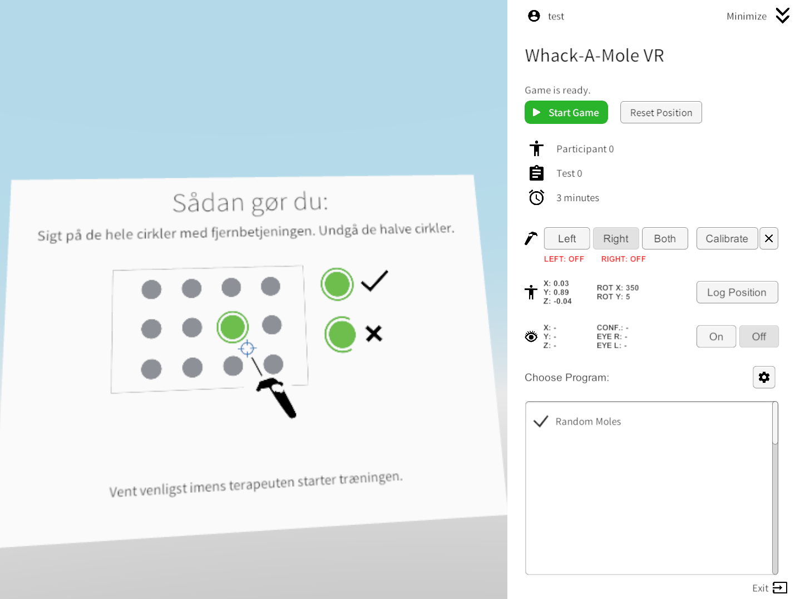
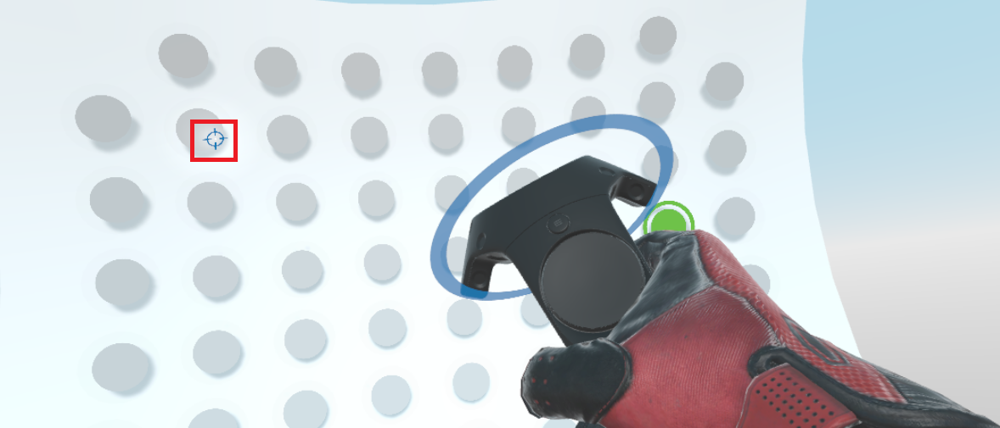
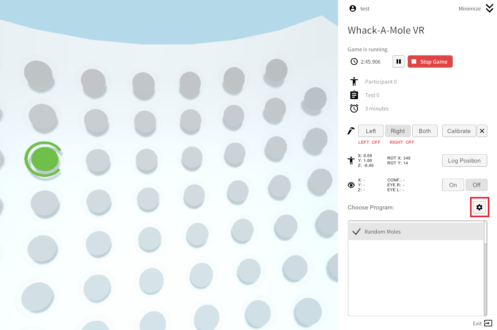
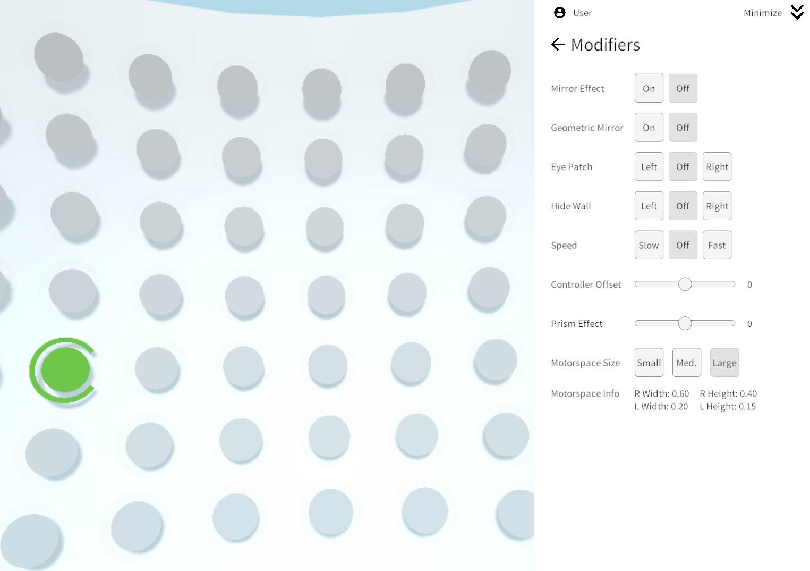
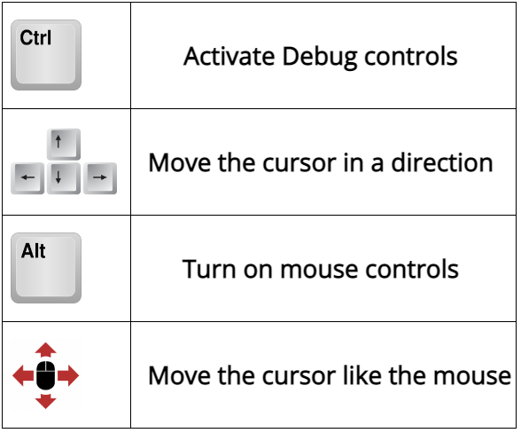
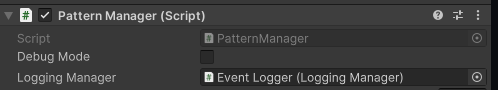

# Whack-A-Mole VR - Research Platform for VR Stroke Rehabilitation

Whack-A-Mole VR is a research platform, data collection device, and experimental protocol game designed for upper-limb VR rehabilitation for stroke and visual neglect. It consists of:

 * [Whack-A-Mole-VR - Game](https://github.com/med-material/Whack_A_Mole_VR) (this repository)
 * [Online Dashboard for Data Analysis](https://github.com/med-material/Whack_A_Mole_RShiny)
 * Pattern Editor and Treatment Pattern Collection (under development)

## Project Resources
Whack-A-Mole VR is a research project maintained by [Bastian I. Hougaard](https://vbn.aau.dk/da/persons/biho), [Hendrik Knoche](https://vbn.aau.dk/da/persons/hk), [Lars Evald](https://pure.au.dk/portal/en/persons/lars.evald%40clin.au.dk) and [Iris Brunner](https://pure.au.dk/portal/en/persons/iris.brunner%40clin.au.dk) since 2019. The project is still under active research and development and as specified by our [license](https://github.com/med-material/Whack_A_Mole_VR/blob/master/LICENSE), we provide the Whack-A-Mole VR research platform here as-is with no warranty, for the wider XR rehab community to tinker with or run studies with. Feel free to get in touch with us, we would be happy to collaborate.

Learn more about our research here:
 * [Virtual Mirror Therapy in a VR pointing task for stroke rehabilitation.](https://vbn.aau.dk/da/publications/virtual-mirror-therapy-in-a-vr-pointing-task-for-stroke-rehabilit) Abstract from the European Stroke Organisation Conference 2022
 * [Virtual Motor Spaces: Exploring how to amplify movements in VR](https://vbn.aau.dk/da/publications/virtual-mirror-therapy-in-a-vr-pointing-task-for-stroke-rehabilit) Extended Abstract at ICVR 2022.
 * [Whack-A-Mole VR: Demonstration of Accessible Virtual Reality Game](https://vbn.aau.dk/da/publications/whack-a-mole-vr-demonstration-of-accessible-virtual-reality-game-). Short Paper and Demo at NordiCHI 2022.
 * [Virtual Reality Assessment and Treatment of Spatial Neglect (VR@SN)](https://vbn.aau.dk/da/publications/virtual-reality-assessment-and-treatment-of-spatial-neglect-vrsn). Abstract at 11th World Congress for Neurorehabilitation, 2020.

# Whack-A-Mole VR - Unity Project
Whack-A-Mole VR is designed from ground up to be a flexible platform for studying and designing simple VR-based pointing tasks:
 * **Visual Skins**: In its basic state, it mainly provides simple green targets that players must hit. But it's designed to be easy to adapt to other visual metaphors while maintaining the same underlying interaction: catching butterflies, picking apples, and so on.
 * **Modifiers**: Whack-A-Mole VR provides a range of tools to modify or alter the experience, many of which are specifically designed to experimentally treat or diagnose neglect.
 * **Scriptable Patterns**: Whack-A-Mole VR's can load different treatment programs from files known as patterns, which specify how/when targets appear and how/when different modifiers activates.
 * **Data Collection**: Whack-A-Mole extensively logs player movements and interactions, while players are playing.

The game is a simple Whack-a-mole-style game, but in VR. The game is primarily run on VR headsets connected to a computer, from which a facilitator (clinician) controls and monitors the game, while the player is wearing the headset.  In front of the player a wall is presented which show multiple moles (represented by gray disks). When the game starts, moles will activate by changing their color to green. The player will then need to pop the moles by hovering over them with the blue cursor (highlighted by the red square) before they deactivate by themselves. Players hit targets by moving their arm around horisontally or vertically in the air (relative pointing, a bit like using a mouse). There are also distractors, which activates that the player musn't pop.

The environment provides many features to customise the game, with multiple parameters and modifiers available when you click on the modifiers button.

- Game modifiers: 
  - Game duration: allows to set the duration of the game
  - Game speed: allows to set the speed of the game between three options (slow, normal, fast). The higher the speed, the more moles will spawn and the higher the fake moles's spawn coefficient will be.
  - Mirror effect: mirrors the player's VR controller's position and rotation. All their movements will be reversed except the ones on the vertical axis.
  - Geometric Mirror: Creates mirror therapy by providing a ghost secondary controller which mirrors the movements of the player.
  - Eye patch: applies an eye patch. Disables one of the player's eye in the VR headset. Can be set to either left, right or none.
  - Hide Wall: Controls how much of the wall is visible to the player, forcing the player to increase how much head rotation is needed.
  - Speed: In random moles mode, this controls how fast new moles appear.
  - Controller Offset: Offsets the controller from the user's body horisontally. Can be used to force players to move their arm more towards the right or left.
  - Prism effect: applies a rotation of the player's camera, which mean their line of sight change relative to the position of their hand. Forces players to look more to the right or left.
  - Motorspace Size: Changes how much movement is needed to perform the pointing task.

While players play, the game continuously collects data in the background. When a session stops or has finished, the data can either be uploaded to a database or saved locally to disk as a .CSV file. The data can then be visualized on the [online dashboard](https://github.com/med-material/Whack_A_Mole_RShiny).

## Tools for Developers

The application has several tools available to debug and help developing new features.

### Debug controls 
Simple non-VR controls are implemented to use in the game for pattern and visual effects testing.
When starting the application, first you will need to get through the calibration phase. You can bypass this by pressing "V".

### WAM Test Pattern - VS Code Extension
This extension for Visual Studio Code offers improvements to reading and coding treatment programs, with Syntax Highlighting and Auto-Completion, available at this link: https://github.com/tcaruchet/Whack_A_Mole_VR_WAMPAT_VSCodeExtension

### Patterns debug mode
The **Pattern Manager** script has a Debug Mode implemented which, if active, shows information about the state of the current treatment program, the next step, as well as the number of steps and progress through the program.

## Mole Whacking Data Collection

This application logs various game datas, from the activated mole position to the position travelled by the player's laser between two mole poping. The logs are by default saved in the OS documents directory (e.g. C:\Users\XYZ\Documents\), however a custom path can be set from the Unity editor. The logging happens in three diffferent files and the architecture is explained further [here](https://docs.google.com/presentation/d/1iP6VDRuE3DzOMys-ztHc_QtDELSFZ1KeNmDyQoJZi10/edit#slide=id.g1029978cd0c_0_10).

These following events are logged:

* **Game Started**: raised when a game is started
* **Game Paused**: raised when the running game is paused
* **Game Finished**: raised when the game finishes (the game timer reaches 0)
* **Game Stopped**: raised when the game is manually stopped
* **Game Speed Changed To** (Slow, Normal, Fast): raised when the game speed is changed
* **Mirror Effect Set** (True, False): raised when the mirror effect modifier is changed
* **Dual Task Set** (True, False): raised when the dual task modifier is changed
* **Prism Effect Set** (-15, 15, float value): raised when the prism effect modifier is changed
* **Eye Patch Set** (Left, Right, None): raised when the eye patch modifier is changed
* **Mole Spawned**: raised when a Mole is activated
* **Fake Mole Spawned**: raised when a Fake Mole (Distractor) is activated
* **Mole Hit**: raised when an activated Mole is hit
* **Fake Mole Hit**: raised when an activated Fake Mole (Distractor) is hit
* **Expired Mole Hit**: raised when an expired Mole (which just deactivated) is hit
* **Mole Expired**: raised when a Mole deactivates without being hit
* **Fake Mole Expired**: raised when a Fake Mole (Distractor) deactivates without being hit
* **Pointer Shoot**: raised when the laser is shot
* **Mole Missed**: raised when a shot didn't hit any Mole

The logged data are:

* **Email**: the email of the selected profile
* **Date**: the date in the yyyy-mm-dd normalized format
* **Time**: the time in the hh:mm:ss normalized format
* **TimeStamp**: a time stamp in the yyyy-mm-dd hh:mm:ss.mmm format referencing the instant a given event happened
* **ParticipantId**: the ID of the participant, corresponding to a number set by the Therapist before launching the game
* **TestId**: the ID of the test, corresponding to a number set by the Therapist before launching the game
* **GameId**: a unique ID given to the current game
* **PlayedPattern**: the pattern being played
* **Event**: the name of the event raised
* **EventType**: the type of the event. Can be a GameEvent, a MoleEvent, a PointerEvent or a ModifierEvent
* **TimeSinceLastEvent**: the time spend between this event and the previous one
* **GameState**: the current state of the game (e.g. Game Paused)
* **GameSpeed**: the current speed of the game (e.g. Fast)
* **GameDuration**: the duration in seconds of the game
* **GameTimeSpent**: the time spent since the game started
* **GameTimeLeft**: the time left before the current game ends
* **RightControllerMain**: is the right controller the main controller (e.g. True, False)
* **MirrorEffect**: is the mirror effect modifier activated (e.g. True, False)
* **EyePatch**: the eye patch position (e.g. Left, Right, None)
* **PrismEffect**: is the prism effect activated (e.g. True, False)
* **DualTask**: is the dual task activated (e.g. True, False)

* **MoleId**: the unique ID of the mole, being a four digits number
* **MoleIndexX**: the X index of the mole
* **MoleIndexY**: the Y index of the mole
* **MolePositionWorld** (X, Y, Z): the world position of the mole concerned by the event, separated in three parameters for each axis
* **MolePositionLocal** (X, Y, Z): the local position of the mole concerned by the event, separated in three parameters for each axis
* **MoleLifeTime**: the duration the mole will stay activated
* **MoleActivatedDuration**: the time the mole spent activated before deactivating/being poped
* **CurrentMoleToHitId**: the unique ID of the current mole to hit, being a four digits number
* **CurrentMoleToHitIndexX**: the X index of the current mole to hit
* **CurrentMoleIndexY**: the Y index of the current mole to hit
* **CurrentMolePositionWorld** (X, Y, Z): the world position of the current mole to hit, separated in three parameters for each axis
* **CurrentMolePositionLocal** (X, Y, Z): the local position of the current mole to hit, separated in three parameters for each axis
* **ClosestActiveMoleDistance** (X, Y): the global position of the closest active Mole, on the X and Y axis

* **ControllerSmoothed**: if the movement of the controller's lazer is somoothed or not
* **ControllerAimAssistState**: the aiming assistance used
* LastShotControllerRawPointingDirection (X, Y, Z): the pointing direction of the last lazer shot without filtering (aim assistance or smoothing)*
* LastShotControllerFilteredPointingDirection (X, Y, Z): the pointing direction of the last lazer shot with filtering (aim assistance or smoothing)*
* (Right, Left) **ControllerPosWorld** (X, Y, Z): the world position of the right/left controller, separated in three parameters for each axis
* (Right, Left) **ControllerPosLocal** (X, Y, Z): the local position of the right/left controller, separated in three parameters for each axis
* (Right, Left) **ControllerRotEuler** (X, Y, Z): the rotation in euler angles of the right/left controller, separated in three parameters for each axis
* (Right, Left) **ControllerPosTravel** (X, Y, Z): the total distance that the right/left controller travelled since the last time this parameter was logged, separated in three parameters for each axis
* (Right, Left) **ControllerRotTravel** (X, Y, Z): the total angle that the right/left controller travelled since the last time this parameter was logged, separated in three parameters for each axis
* **HeadCameraPosWorld** (X, Y, Z): the world position of the head camera, separated in three parameters for each axis
* **HeadCameraPosLocal** (X, Y, Z): the local position of the head camera, separated in three parameters for each axis
* **HeadCameraRotEuler** (X, Y, Z): the rotation in euler angles of the head camera, separated in three parameters for each axis
* **HeadCameraPosTravel** (X, Y, Z): the total distance that the head camera travelled since the last time this parameter was logged, separated in three parameters for each axis
* **HeadCameraRotTravel** (X, Y, Z): the total angle that the head camera travelled since the last time this parameter was logged, separated in three parameters for each axis
* (Right, Left) **ControllerLaserPosWorld** (X, Y, Z): the world position of the right/left controller's laser, separated in three parameters for each axis
* (Right, Left) **ControllerLaserPosLocal** (X, Y, Z): the local position of the right/left controller's laser, separated in three parameters for each axis
* (Right, Left) **ControllerLaserRotEuler** (X, Y, Z): the rotation in euler angles of the right/left controller's laser, separated in three parameters for each axis
* (Right, Left) **ControllerLaserPosTravel** (X, Y, Z): the total distance that the right/left controller's laser travelled since the last time this parameter was logged, separated in three parameters for each axis

* **WallRowCount**: the count of rows of Moles on the wall
* **WallColumnCount**: the count of columns of Moles on the wall
* **WallSize** (X, Y, Z): the world size of the wall on the X, Y and Z axes
* **WallCurveRatio** (X, Y): the curving ratio of the wall on the X and Y axes

* **PupilTime**: The time in the PupilTime format, at the time the logging takes place.
* **PupilTimeSample**: The time in PupilTime format, at the time we receive gaze data.

Meta logs:
* SessionState: This is the state of the game, at the time it stopped and was logged. Its values are either "Finished" (if the treatment program naturally ended) or "Interrupted" (if the treatment program was interrupted). This is different from GameState, which logs the state of the game at a given timestamp.
* SessionDuration: the duration of the session in seconds.
* SessionID: A unique MD5 based ID of the session.
* SessionProgram: What program the session was running.
